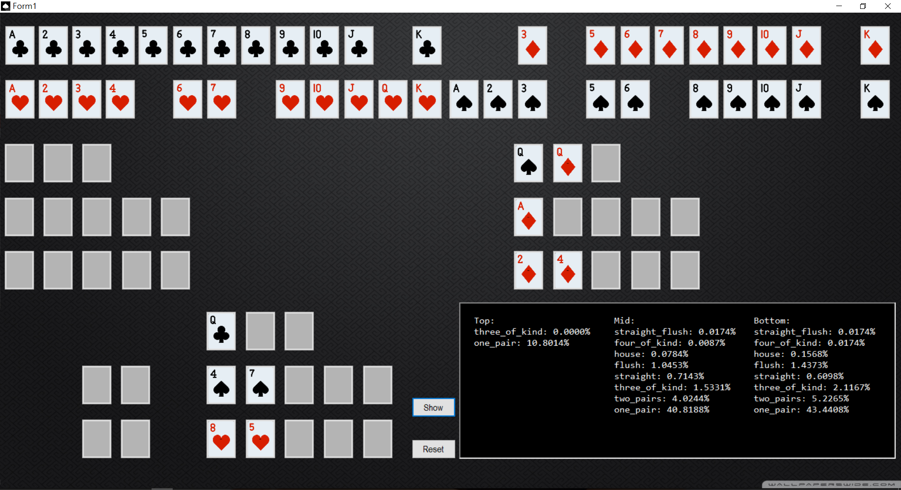

# Open_Face_Poker_Probability_Calculator

## Description

This is a probability calculator for ofc poker game. It help you can get your hand cards developmental immediately.

The method based on combination. The method would compute every your hand and remaining card combination, and used a prime number powerset to ranking all of possibility deck. Finally, we can get the probability of all deck.

I even try to use monte carlo simulation to run the every round of game, and count every result to instead a math method. But, it take a lot of time and very inefficiently. So, I give up monte carlo simulation......

Finaly, I learn a lot from monte carlo, it inpsire me to use random to figure out simulation question.

In the end of my word, I want to thx to my brother. He give me the chance to do real case, thx.

## How to Run

1. Pick your hand card, put poker into picked card.

2. press show button.

## License

That samples are licensed under the terms of the [MIT License](http://opensource.org/licenses/MIT).

## Written by

Roy Huang  

National Taiwan University 

Civil Engineering - Department of Computer Added Engineering 
